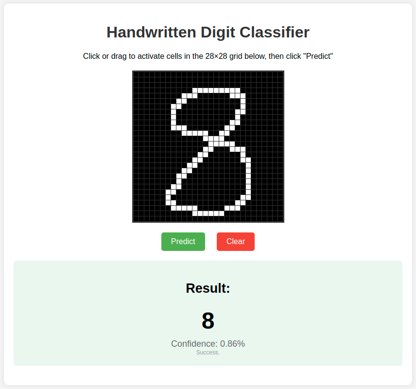

# Digit Recognition Web Application


A web application that allows users to draw digits on a 28x28 grid and uses a trained convolutional neural network (CNN) to recognize the drawn digit.

#### Features

- Interactive drawing interface with 28x28 grid
- Real-time digit classification with confidence scores
- Dockerized for easy deployment
- Fully responsive design with mobile support

#### Technologies

- **Frontend**: HTML, CSS, JavaScript
- **Backend**: Flask
- **ML Model**: PyTorch CNN
- **Deployment**: AWS EC2, Docker

#### Deployment Instructions

1. Clone this repository
2. Navigate to the mnist-server directory:
   ```bash
   cd mnist-server
   ```
3. Build the Docker image:
   ```bash
   docker build -t mnist-server .
   ```
4. Run the container:
   ```bash
   docker run -p 80:8080 mnist-server
   ```
5. For AWS EC2 deployment, follow the instructions in the [deployment guide](mnist-server/DEPLOYMENT.md) **(WORK IN PROGRESS...)**

#### Screenshot



